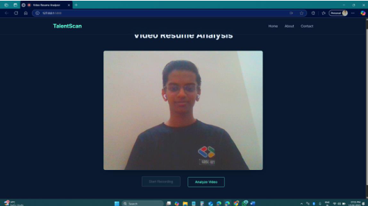
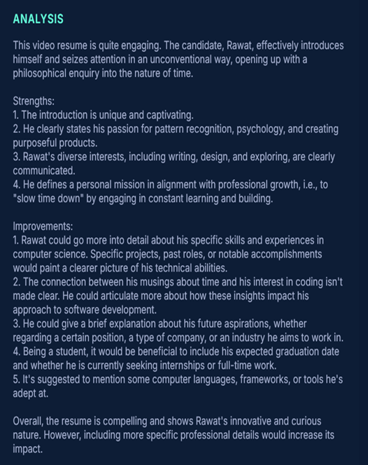

Steps for implementing this project :

1. Install requirement.txt
    pip install -r requirement.txt

2. Install ffmpeg
    https://www.ffmpeg.org/download.html

3. Create .env file and add your OpenAI API key
    OPENAI_API_KEY = ...

4. Run the application
    python main.py

Sample Input

Sample Output

](image-1.png)

